# Ospedale San Duziano
## Indice 
1. [Introduzione](#1-introduzione)  
    1.1 [Descrizione caso di studio](#11-caso-di-studio)  

2. [Diagramma delle classi](#2-diagramma-delle-classi)  
3. [Specifica algebrica](#3-specifica-algebrica)
4. [Argomenti del corso](#4-argomenti-del-corso)  
    4.1 [Collection](#41-collection)  
    4.2 [Eccezioni](#42-eccezioni)  
    4.3 [File](#43-file)  
    4.4 [Database](#44-database)  
    4.5 [Thread](#45-thread)  
    4.6 [API RESTful](#46-api-restful)  
    4.7 [Swing](#47-swing)  
    4.8 [Lambda Expressions](#48-lambda-expressions)  

# **1. Introduzione**
## **1.1 Descrizione caso di studio**
Il caso di studio presentato e descritto all'interno di questo progetto prende il nome di : "Ospedale San Duziano" proprio in riferimento a dove l'avventura testuale avrà effettivamente luogo.  
La trama del gioco si sviluppa attraverso una serie di situazioni comiche, incontri bizzarri e ostacoli da superare durante la ricerca dell'ingrediente segreto.

L'obbiettivo dell'utente sarà quello di esplorare il luogo, raccogliere indizi e informazioni utili, risolvere enigmi e superare sfide per avanzare nella trama e portare a termine con successo la sua missione. Pertanto ogni stanza potrebbe nascondere segreti e risorse utili per il progresso di quest'ultimo, che dovrà esplorare attentamente e interagire con gli oggetti e i personaggi presenti.

## **1.2 Funzionalità implementate**
Numerose sono le funzionalità che presenta questa avventura testuale, tra queste, sicuramente una delle scelte implementative più significative è stata quella di rendere l'esperienza più coinvolgente introducendo una rappresentazione grafica del gioco. Offrendo al giocatore una rappresentazione visiva dell'ambientazione e delle situazioni che incontra lungo il percorso, coinvolgendo maggiormente l'utente.  
- **Grafica**: L'aggiunta di una grafica suddivisa in pannelli, in base allo stato attuale del gioco, ha reso l'interfaccia più intuitiva e facile da comprendere. Ogni pannello corrisponde a una determinata situazione o ambiente all'interno del gioco, consentendo al giocatore di visualizzare in modo chiaro e immediato le opzioni disponibili e il contesto in cui si trova.   
- **Salvataggio**: Un'altra significativa funzionalità, è la possibilità di salvare la partita in qualsiasi momento tramite il comando "salva", permettendo ai giocatori, tramite il nickname di questi ultimi, di riprendere l'avventura dal punto esatto in cui l'hanno lasciata in un secondo momento.  
- **Varie meccaniche di gioco**: Per rendere l'esperienza di gioco più fluida e intuitiva, il sistema di interpretazione dei comandi è progettato per accettare anche termini simili e sinonimi, consentendo ai giocatori di esprimersi in modo naturale e ottenere risposte coerenti e significative dall'ambiente di gioco.
Tra i comandi principali figura sicuramente "osserva", che permette di analizzare dettagliatamente l'ambiente, e "raccogli" insieme ad altri comandi, che consentono di interagire con gli oggetti e raccoglierli per l'uso futuro.

      
    Inoltre, i giocatori hanno la possibilità di interagire con personaggi non giocanti (NPC) presenti nell'ospedale, scambiando battute, chiedendo informazioni o ottenendo suggerimenti utili per proseguire nell'avventura.

     

    In conclusione, la combinazione di queste scelte implementative ha reso possibile la creazione di una avventura testuale dinamica, aggiungendo un tocco di modernità rispetto alle tradizionali avventure testuali.

## **2 Diagramma delle classi**
    
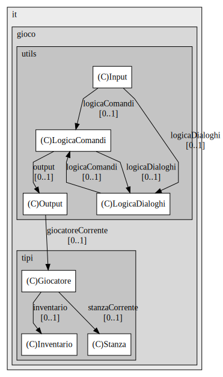
  
La classe *Output* è progettata per gestire principalmente la visualizzazione della storia del gioco, delle immagini associate alle varie stanze del gioco stesso e dell'output in generale.
Dopo la creazione dell'istanza di *Output*, il metodo `run` viene eseguito all'interno di un thread dedicato che rimane in attesa  grazie al metodo `aspettaCambioStanza` finchè non viene notificato un cambio di stanza, in questo modo il thread si occupa di aggiornare la storia.
Per quanto riguarda le immagini relative alla stanza corrente, la classe si avvale di un metodo `impostaImmagineStanzaCorrente` per cercare i file di immagine PNG o GIF corrispondenti e mostrarli a video.

Questo diagramma UML raffigura la classe `GameModel`

## **3 Specifica algebrica**

## **4 Argomenti del corso** 

 ### **4.1 Collection**

 All'interno del casio di studio sono state utilizzate le seguenti collection:

_**LIST**_

* La classe `GameModel` ha una lista di oggetti di tipo `Stanza`, e questa lista viene utilizzata per inizializzare quest'ultime quando viene avviata una partita.

* La classe `LogicaComandi` ha una lista di oggetti di tipo `Stanza` che viene utilizzata per mantenere un elenco delle stanze disponibili nel gioco, in seguito alla logica dei comandi dietro l'avventura risulta necessario accedere alle stanze.

* La classe `NPC` ha una List di tipo `String`, contente una serie di dialoghi relativi agli NPC

* La classe JFrameRinger utilizza un `ArrayList` denominato sequenza che viene per memorizzare la sequenza di composti selezionati dall'utente.

* La classe JPanelPartita utilizza una List di oggetti di tipo `Stanza` che serve per memorizzare un elenco di stanze che fanno parte del gioco.

 _**SET**_

* La classe `Inventario` utilizza una collezione di tipo Set per memorizzare gli oggetti contenuti nell'inventario, presentando anche i vari metodi ausiliari per gestire le varie possibilità come : _aggiungiOggetto_ , _rimuoviOggetto_ e _booleanContieneOggetto_

* La classe `NPC` utilizza una collezione di tipo Set per memorizzare gli oggetti posseduti dai vari NPC all'interno dell'avventura testuale

* La classe `Stanza` utilizza un Set per gli oggetti presenti all'interno delle varie stanze del gioco

* La classe `Init` utilizza un Set *stopwords* utilizzato per contenere tutte le stopwords recuperate dal file 

* La classe `Parser` utilizza un Set di oggetti di tipo `String` relative alle stopWords.

 _**MAP**_

 * La classe `Output` si avvale di una struttura dati MAP per memorizzare le descrizioni delle stanze del gioco. Ogni stanza è associata ad una descrizione, dove la chiave della mappa è il nome della stanza ed il valore è la descrizione corrispondente.
 Metodi presenti nella classe utilizzano questa MAP come ad esempio il metodo `caricaStoriaDaFile` che legge le descrizioni delle stanze da un file e le carica nella mappa, utilizzando il nome della stanza come chiave e la descrizione come valore

 * La classe `Init` utilizza la struttura dati per memorizzare i comandi del gioco

 * La classe `Stanza` utilizza una Map(direzione, stanza) per rappresentare le connessioni tra le varie stanze, ovvero tra la stanza corrente e altre stanze attraverso le direzioni possibili (Nord, sud, est , ovest)

 ##

 ### **4.2 Eccezioni**

 All'interno di questo progetto, è emerso un ampio ricorso alle eccezioni questo poichè le eccezioni, fondamentali nella gestione degli errori, vengono utilizzate in molti metodi per gestire situazioni impreviste o errori di esecuzione. In seguito verranno mostrate alcune delle principali eccezioni.

 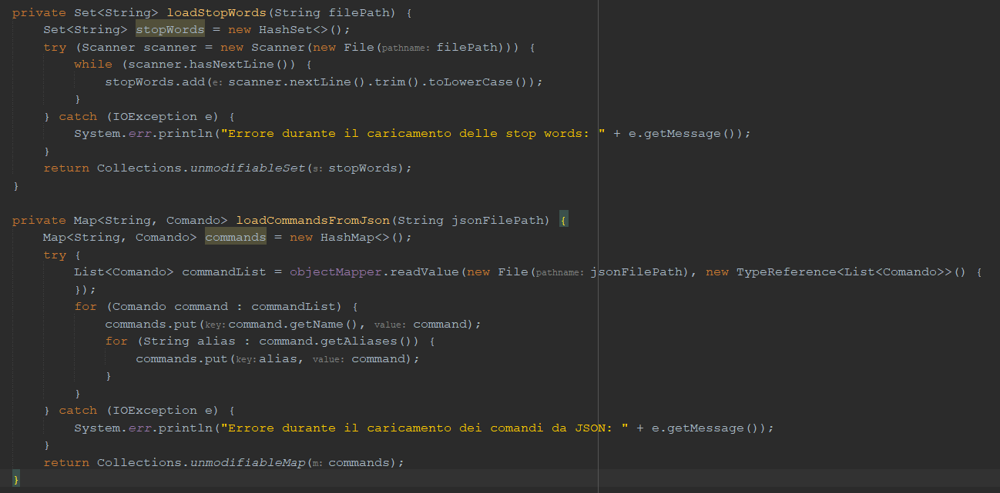

 I metodi `loadStopWords` e `loadCommandsFromJson` mostrati in questa immagine sono rispettivamente utili per caricare le `StopWords` e il `comandi` da file. Il blocco try-catch permette di controllare e gestire situazioni anomale, in questo caso si tratta di una eccezzione _IOException_ che indica un errore durante l'operazione di input/output, che può verificarsi quando si tenta di leggere o scrivere da un file.

 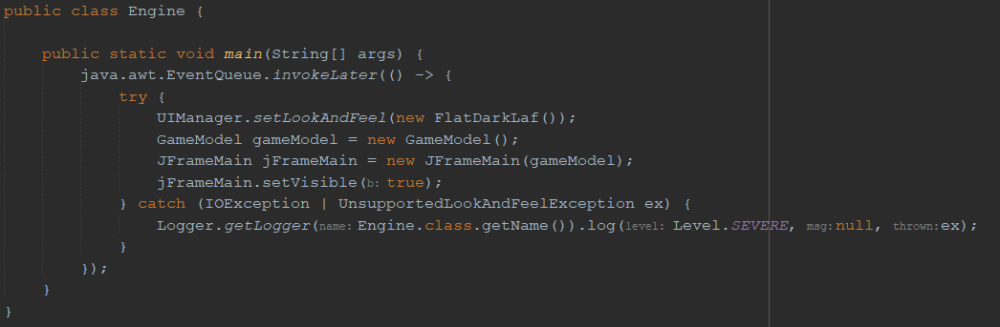
 
 In questo caso invece, oltre l'eccezione _IOException_ vi è anche un'altra eccezione ovvero : `UnsupportedLookAndFeelException` , poichè all'interno del nostro programma abbiamo utilizzato un Look & Feel per personalizzare la grafica,gestiamo questa eccezione quando si tenta di impostare un Look and Feel non supportato nell'interfaccia utente Swing.

 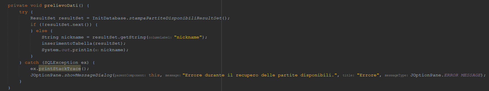

 L'eccezione gestita in questo metodo `prelievoDati`, all'interno della classe `JPanelMostraPartite` che si occupa di mostrare una tabella con le relative partite salvate, viene sollevata quando si verifica un errore durante l'accesso o la manipolazione di un database SQL.
Il blocco try-catch quindi viene utilizzato per gestire questo nuovo tipo di eccezione che qualora dovesse verificarsi informa l'utente mostrando un messaggio di errore

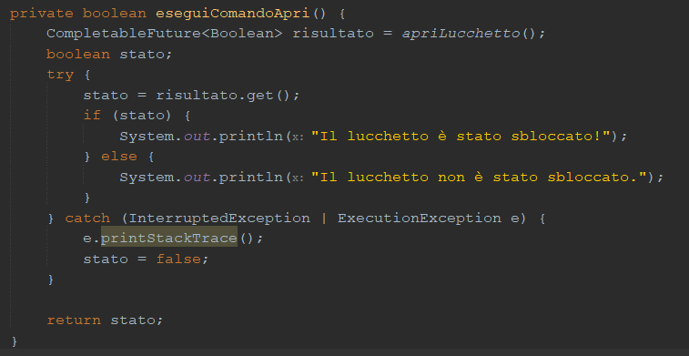

Le eccezioni che vengono gestite all'interno del metodo `eseguiComandoApri`, sono: _InterruptedException_ e _ExecutionException_ , entrambe vengono gestite nello stesso modo nel blocco catch , e fanno rispettivamente riferimento ad eccezioni sollevate quando:  un thread viene interrotto mentre è in stato di attesa e quando un'eccezione viene sollevata durante l'esecuzione di un'operazione.

##

### **4.3 File**

L'utilizzo e la gestione dei `File` all'interno del nostro programma svolge un ruolo fondamentale per quanto riguarda il funzionamento complessivo del sistema e della gestione della logica del gioco.
Sono stati adottati per svariate funzioni come l'inizializzazione degli attributi principali della varie classi, infatti sono stati utilizzati per memorizzare e caricare le principali informazioni relative al gioco. Dal punto di vista grafico, ci hanno permesso di ricostruire il filePath delle immagini in modo tale da poter essere caricate dinamicamente.

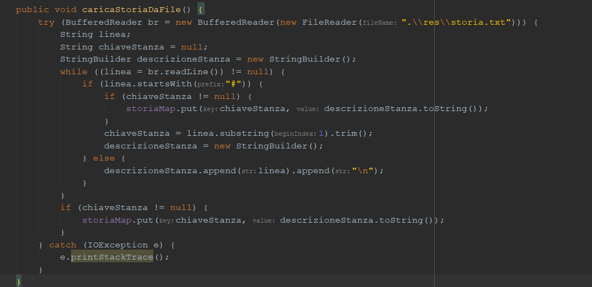

Il metodo `caricaStoriaDaFile` si occupa di caricare la storia dell'avventura testuale da un file di testo presente nella cartella _res_ chiamato `Storia.txt`
Per il caricamento della storia si potevano utilizzare diversi approcci; 
L'idea iniziale è stata quella di creare più file _txt_ , per ogni stanza e in modo dinamico ricostruire il _path_ del file tramite il nome della stanza, come accade per il caricamento delle immagini.
Con questo approccio avremmo avuto tanti file `_txt_` con uno scarso contenuto, infatti, per questo motivo abbiamo optato nell'utilizzo di un unico file `_txt_` nel quale, la storia delle varie stanze viene divisa da un placeholder `#` che precede il nome della stanza.
Viene creato un oggetto `_BufferedReader_` per leggere il file di testo utilizzando `_FileReader_` per aprire il file.
La lettura del file avviene riga per riga verificando che ci sia il placeholder, una volta individuato, indica che il contenuto dopo esso `#` rappresenta il nome della stanza e quindi la chiave da inserire nella mappa.
In questo modo fin quando non si incontrerà un nuovo `#` , verrà costruita la descrizione relativa a quella chiave e di conseguenza alla stanza in questione. 
Per la costruzione della descrizione viene utilizzato uno `_StringBuilder_` che serve per eseguire il metodo `_append_` per le varie righe fin quando non si incontrerà un nuovo placheholder. In conclusione quando viene incontrato un nuovo `_#_` , si raccoglie il contenuto e lo si inserisce all'interno della Map. 

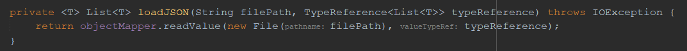
Un'altra applicazione dei `File`, son stati i `file JSON` infatti:  
Abbiamo creato un metodo in questo caso `loadJSON` che restituisce una lista di oggetti di tipo T, dove T è un tipo generico, in questo modo richiamiamo questo metodo specificando il filepath e il tipo desiderato, permettendo di caricare le istanze dal file `Json` .  
Nel nostro progetto questo sarà molto utile per caricare le istanze della classe _Stanza_ e utilizzando il metodo citato prima avremo la possibilità di ottenere queste istanze in una Lista di Stanze.
Durante la partita, i progressi di gioco inclusi i vari campi ed attributi delle stanze, saranno modificati su questa lista.

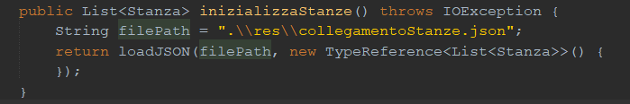

Tramite questo metodo utilizziamo `loadJSON` per ottenere le istanze delle stanze sotto forma di Lista, la quale sarà poi una variabile globale nelle varie classi in cui sarà necessaria la modifica delle stanze. 
In conclusione questi rappresentano solo alcune della varie applicazioni implementate all'interno dell'avventura testuale dato che vi sono varie rappresentazioni.

##  

### **4.4 Database** 

All'interno del nostro progetto, abbiamo integrato un database H2 che ci ha consentito di memorizzare e salvare i progressi di una partita dunque garantire il salvataggio dei dati di gioco.
Queste funzionalità sono state implementate all'interno delle due classi  `InitDatabase` e `DatabaseUtil` che gestiscono le operazioni di acesso e manipolazione del database.
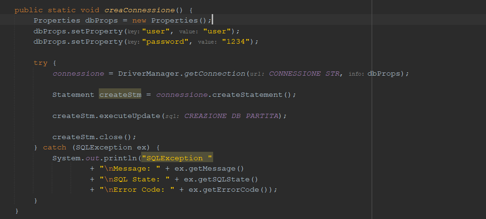
In particolare la classe `initDatabase` come prima cosa attraverso il metodo `creaConnessione` stabilisce la connessione al databse H2 utilizzando la stringa di connessione specificata, successivamente si occupa di creare la tabella delle partite e in seguito implementa i vari metodi: `salvaPartita` `caricaPartita` ed `eliminaPartita` che si occupano rispettivamente di salvare una partita sul database, caricare una partita dal database utilizzando l'ID della partita ed infine eliminarne una.  
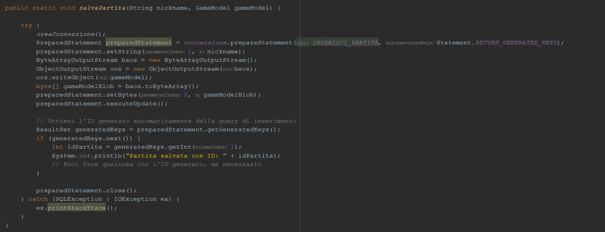
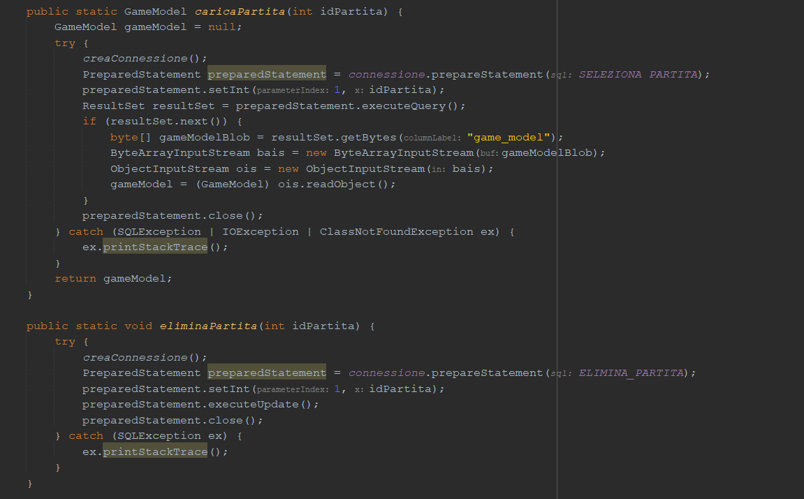
Infine vi è anche il metodo sottostante: che si occupa invece di mostrare quelle che sono tutte le partite salvate riportando : `ID PARTITA`, `Nickname`, `Timestamp`.
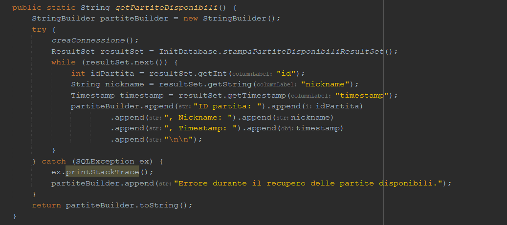

##

### **4.5 Thread**
L'implementazione dei Thread all'interno del nostro progetto è stata utile per gestire delle operazioni concorrenti in quanto appunto in Java un thread rappresenta un flusso separato di esecuzione all'interno di un programma, consentendo più operazioni contemporaneamente.

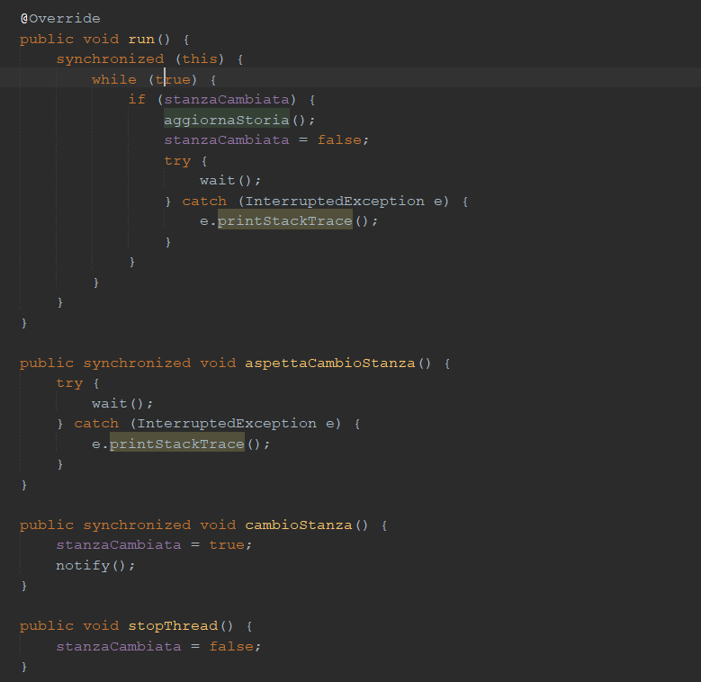

I thread nel nostro progetto svolgono un ruolo fondamentale nell'aggiornamento dinamico della storia del gioco quando il giocatore cambia stanza. Questo avviene attraverso i metodi presenti nella classe Output, che estende la classe Thread. Ecco come i principali metodi si relazionano al funzionamento dei thread:

Il meotodo `caricaStoriaDaFile` legge la storia del gioco da un file di testo e la carica in memoria. Viene chiamato all'avvio dell'applicazione o quando è necessario ricaricare la storia da file. Il metodo `aggiornaStoria` viene chiamato quando il giocatore cambia stanza e si occupa di aggiornare l'interfaccia utente con la descrizione della nuova stanza. Questo aggiornamento avviene all'interno del thread gestito dalla classe _Output_ .
Il metodo `aspettaCambioStanza` mette il thread in attesa finché non viene notificato un cambio di stanza, mentre il seguente metodo `cambioStanza` segnala al thread che è necessario aggiornare la storia in seguito ad un cambio di stanza rilevato.

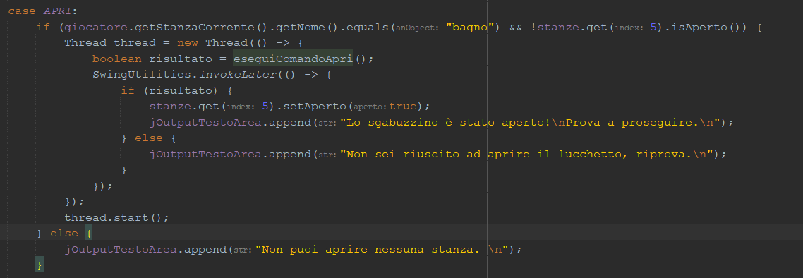

In questo caso invece, quando viene eseguito il comando `Apri`, viene controllato se il giocatore si trova nella stanza _bagno_ e se lo _sgabuzzino_ non è ancora aperto;   Qualora queste condizioni siano soddisfatte viene creato un nuovo thread per mostrare un minigioco che simula lo sblocco di un lucchetto in maniera grafica e dinamica.   In questo quando il thread viene avviato chiamando il metodo `start`, il suo codice viene eseguito in parallelo rispetto al thread principale del programma, consentendo all'interfaccia utente di rimanere reattiva mentre vengono eseguite operazioni che richiedono tempo nel backgorund.

##
### **4.6 API RESTful**
Le API RESTful consentono di accedere e manipolare delle risorse tramite URL, seguendo un approccio stateless, ovvero che ogni richiesta HTTPS contiene tutte le informazioni per eseguire l'operazione desiderata. 

Nel nostro caso abbiamo utilizzato 2 differnti API `API Advice Slip` `API MyMemory Translation`, la prima fornisce consigli casuali in lingua inglese, quindi permette di ottenere consigli in lingua inglese, che vengono successivamente tradotti in italiano dalla seconda `API`. 
Nello specifico prende in input il testo in lingua inglese e restituisce la traduzione in italiano.
Non vi è una reale correlazione con quello che è l'ambiente e il contesto di gioco sviluppato nel progetto, tuttavia per implementare comunque questi strumenti abbiamo ritenuto, tra le varie API gratis disponibili, che questa fosse quella migliore.
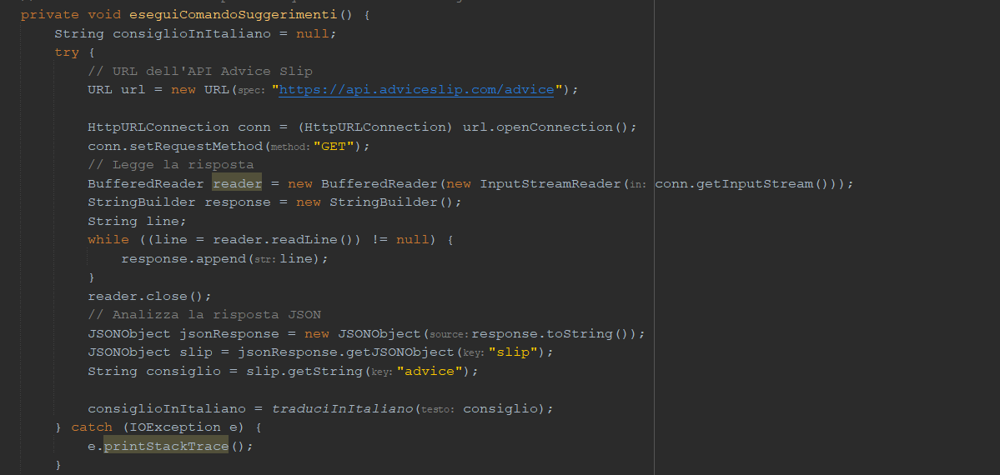
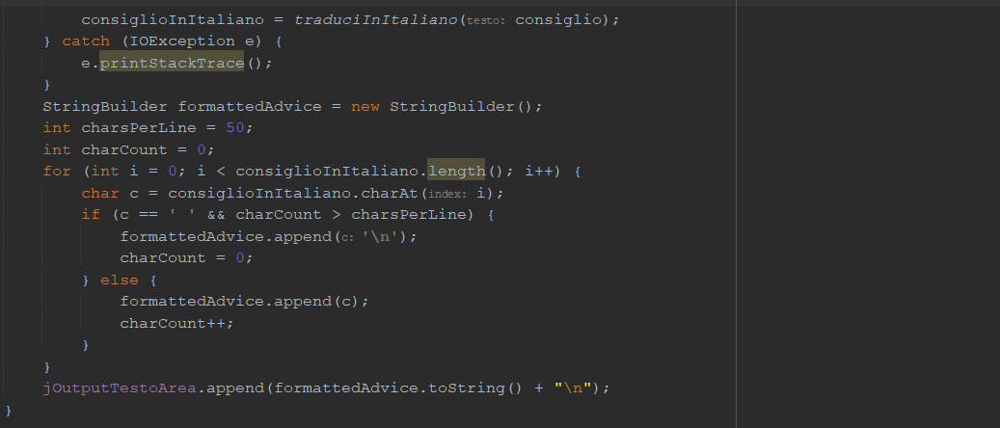

Come prima cosa viene creato un oggetto `URL` che punta all'endpoint dell'API Advice Slip, viene aperta una connessione HTTP utilizzando `HttpURLConnection` e viene impostato il metodo di richiesta su `GET`. 
In seguito viene letta la risposta dall' _API_ e memorizzata all'interno di un oggetto `StringBuilder` e viene analizzata per estrarre il consiglio casuale utilizzando la libreria `JSONObject`. Infine il consiglio in lingua inglese viene formattato e tradotto in italiano utilizzando il metodo `traduciInItaliano`.

##
### **4.7 Swing**

##
### **4.8 Lambda Expressions**
Le lambda expressions costituiscono un concetto essenziale all'interno della programmazione moderna, consentendo una maggiore flessibilita' nella definizione e nel passaggio di funzionalita' all'interno del codice. Simili al concetto di funzioni anonime, le lambda expressions offrono la possibilita' di definire implementazioni di operazioni in modo compatto. La sintassi delle espressioni lambda comprende parametri, rappresentati dalle parentesi, una freccia -> e successivamente il corpo dell'espressione; quest'ultimo può essere costituito da una singola istruzione o da un blocco di istruzioni racchiuso tra parentesi graffe. Questa sintassi "compatta" rende le espressioni lambda ideali per passare comportamenti in modo leggibile e conciso. Un esempio comune di utilizzo delle espressioni lambda e' nei contesti in cui si operano su collezioni di dati, come ad esempio le operazioni sugli stream. Queste espressioni consentono di specificare operazioni come il filtraggio, la trasformazione e l'elaborazione dei dati in modo più diretto.

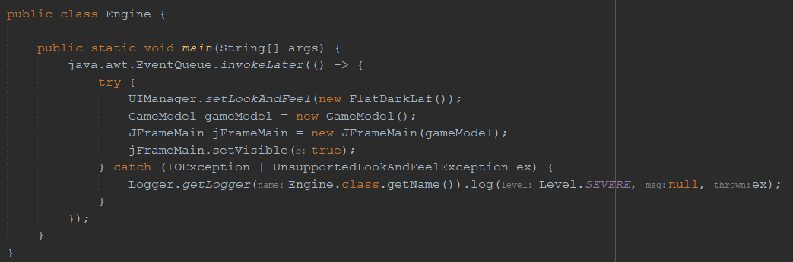

Nel nostro caso la Lambda Expression presente nel metodo main della clase `Engine` viene utilizzata per eseguire un'azione in un thread separato responsabile dell'interfaccia utente. Questo viene realizzato per garantire che il thread principale rimanga reattivo durante l'esecuzione delle operazioni di inizializzazione. Il metodo 
 `java.awt.EventQueue.invokeLater(() -> { ... }) `
 accetta un'istanza di  ` Runnable` e la esegue nel thread dell'evento AWT (Abstract Window Toolkit); L'invokeLater viene utilizzato per assicurarsi che il codice all'interno della lambda expression venga eseguito in modo asincrono come detto prima.
 Questa Lamda Expressions è composta da due parti: le parentesi vuote indicano che non accetta nessun argomento, mentre la seconda parte è rappresentata dal corpo che contiene le istruzioni da eseguire.  
 Più precisamente in questo caso rappresenta il corpo consiste nel codice che inizializza il  `Look&Feel ` dell'interfaccia utente, crea l'istanza di  `GameModel ` e di  `JFrameMain `, rendendolo visibile. 

